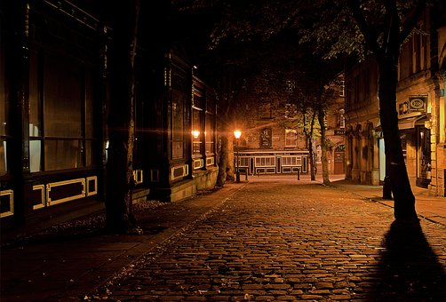
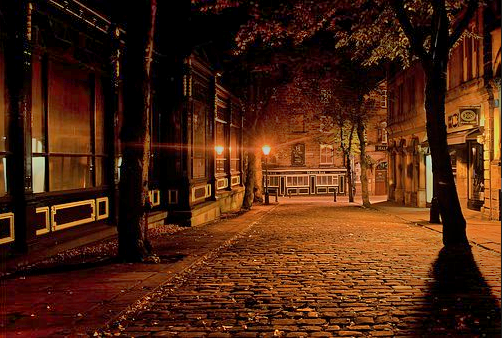

# LowLightImageEnhance
Low-Light Image Enhancement Algorithm in C++ and Python

Utilized dehazing algorithm on inverted images as a way to enhance low-light images. Made in both C++ and Python. Inspiration from https://github.com/joyeecheung/dark-channel-prior-dehazing/tree/master

